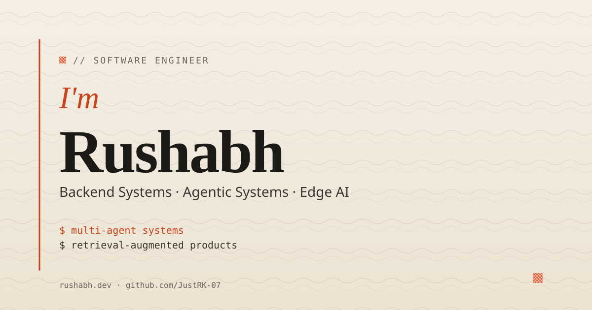

<p align="center">
  
</p>

<h1 align="center">Rushabh Kalme — Personal Portfolio</h1>

<p align="center">
  <a href="https://rushabh.dev"></a>
  <a href="https://github.com/JustRK-07/portfolio/blob/main/LICENSE"></a>
  
  
</p>

<p align="center">
  
  
  
  
  
  
</p>

<p align="center">
  <sub>Live at <a href="https://rushabh.dev"><b>rushabh.dev</b></a> · built with Astro 5 + MDX + Tailwind CSS, deployed on Vercel.</sub>
</p>

---

The source code for my personal portfolio. Nine engineering projects — multi-agent credit pipelines, CAD validation at ISGEC Heavy Engineering, real-time WebRTC, on-device computer vision, federated ML — rendered through a cream/orange editorial visual system I designed on top of Astro 5.

- **Stack** — Astro 5 (static) · MDX content · Tailwind 3.4 · Vercel adapter · `@vercel/analytics`
- **Type** — Static site · MDX-backed content collections
- **Style** — Editorial cream/orange (`#F5EFE6` paper · `#C8451F`/`#E55934` accent · Fraunces + Instrument Serif + Inter + JetBrains Mono)
- **Live** — https://rushabh.dev

## What's inside

| Section | What it covers |
|---|---|
| **Hero** | `I'm RUSHABH` lockup with polaroid portrait slot, typewriter focus areas, four-stat metric strip |
| **Featured cases** (×2) | `01 / 09` counter, category pill, hero metric footer, ISGEC partner link on ADV |
| **Experience** | Genxa Solutions internships with full per-intern bullet detail |
| **Projects** (7) | Searchable + filterable grid, carousel-able product screenshots per card |
| **Patents & Publications** | IEEE paper at I2ITCON 2026 + four filed patent applications |
| **Right rail** | Education · Skills · Achievements · Testimonials · Contact |

Plus three case-study routes (`/projects/<slug>/`) for the projects with `caseStudy: true` — each with a partner credit block (e.g. ISGEC), an `// outcome` metrics strip, and an `// screens` gallery.

## Design system

Cream paper surface (`#F5EFE6`) with vibrant orange-red accents (`#E55934` for fills, `#C8451F` for AA-safe text). Editorial typography pairing: **Fraunces** (variable 400/600/800) for the giant `RUSHABH` wordmark and section headings, **Instrument Serif italic** for accents like `I'm` and testimonial quotes, **Inter** for body, **JetBrains Mono** for code and eyebrows.

Every project card has a **topographic landscape cover** generated through the `mmx-cli` MiniMax image-01 skill. All UI screenshots live under `public/images/projects/screens/<slug>-N.webp` and are used on the case-study pages.

The full token system is defined in [`src/styles/globals.css`](./src/styles/globals.css) as CSS custom properties and surfaced through [`tailwind.config.mjs`](./tailwind.config.mjs). `darkMode` is locked to the cream palette in v1 — the prefers-color-scheme media query is intentionally commented out.

## Editing content

All content lives in `src/content/` as MDX/YAML collections. Add a new file and it appears in the right rail/grid automatically.

| To add | Where | Notes |
|---|---|---|
| **Project** | `src/content/projects/<n>-<slug>.mdx` | Full frontmatter; appears in the projects grid + filter; `caseStudy: true` enables `/projects/<slug>/` |
| **Experience** | `src/content/experience/<n>-<company>.mdx` | Numbered for sort order |
| **Patent / Publication** | `src/content/patents/<n>-<slug>.yaml` | YAML data; status one of `Filed`/`Accepted`/`Published` |
| **Achievement** | `src/content/achievements/<n>-<slug>.yaml` | YAML data |
| **Writing post** | `src/content/writing/<slug>.mdx` | `draft: true` to hide in production |
| **Resume** | `public/resume.pdf` | Replace the file |
| **Polaroid photo** | `public/images/rushabh-polaroid.jpg` | Hero swaps from monogram fallback to your photo automatically |
| **og-image** | `public/og-image.svg` | Cream-themed vector; update directly to refresh social previews |

Skills, writing teasers, and testimonials are intentionally hard-coded inline in `src/pages/index.astro` so you can edit them without an MDX round-trip. Move them to content collections whenever you want a content-editing workflow for those.

### Project frontmatter shape

```yaml
title: "Project Title"          # Card headline
year: 2026                       # Year shown in the footer
category: Multi-Agent            # One of: Multi-Agent, Fintech, Edge-AI, Full-Stack, RAG
stack: [python, langchain]       # Used for filter matching
githubUrl: "https://github.com/…" # null if private
thumbnail: "/images/projects/cover-NN-slug.webp"
images:                          # Case-study page gallery
  - "/images/projects/screens/slug.webp"
featured: true                   # Top-2 get featured cards (01 / 09)
caseStudy: true                  # Renders a /projects/<slug>/ route
metrics:                         # Hero metric footer on the card
  - { label: "agents", value: "7" }
role: "Co-architect…"            # Optional: shown in case-study header
partner:                         # Optional: shown as a partner block on case study
  name: "ISGEC Heavy Engineering Limited"
  url: "https://www.isgec.com"
```

The full schema lives at `src/content/config.ts`.

## Generating / regenerating project covers

The nine topographic covers ship pre-generated and committed under `public/images/projects/cover-<slug>.webp`. To regenerate one (after adjusting the prompt, for example):

```bash
mmx image generate \
  --prompt "Abstract topographic landscape illustrated in mid-century atlas style. Cream paper background (#F5EFE6). Fine navy contour lines (#1B2233) trace a <SUBJECT>. Sparse orange-red (#E55934) ridges mark high ground; sage green (#9CB69C) fills the valley basins. No text, no people, no UI, no logos. Sparse and editorial, soft paper grain." \
  --aspect-ratio 16:9 \
  --out-dir public/images/projects \
  --out-prefix cover-<slug> \
  --non-interactive --quiet
```

The `<SUBJECT>` and `<slug>` pairs are documented in `scripts/generate-assets.sh` (subject per project).

## Local development

Requires **Node.js ≥ 18**.

```bash
npm install      # Install deps
npm run dev      # → http://localhost:4321
npm run build    # Static build (also runs astro check)
npm run preview  # Serve the production build locally
```

## Layout

The home page is a single asymmetric scroll:

```
┌──────────────────────────────────────────────────────────────┐
│ ■ Hero       I'm RUSHABH  + polaroid  + pitch + metrics    │
├──────────────────────────────────────────────────────────────┤
│ Featured cases  · Experience  · Projects (left column)      │
│ Education · Skills · Awards · Testimonials (right rail)      │
├──────────────────────────────────────────────────────────────┤
│ Patents & Publications  (full width)                         │
├──────────────────────────────────────────────────────────────┤
│ Get in touch (#contact)  · Footer                            │
└──────────────────────────────────────────────────────────────┘
```

A persistent section index strip (`01 About · 02 Featured · 03 Experience · 04 Projects · 05 Patents · 06 Awards · 07 Contact`) sits below the mobile top bar and sticks on scroll at every breakpoint. Active section is highlighted by an `IntersectionObserver` running in the page footer.

Mobile (`<lg`) collapses everything to single-column: hero, featured cases, experience, projects grid, and the right-rail items in the order Education → Skills → Awards → Testimonials → Writing → Contact.

## Stack

| Layer | Choice | Why |
|---|---|---|
| SSG | [Astro 5](https://astro.build) | Fast static output, MDX-native content collections |
| Content | [MDX](https://mdxjs.com) | One file per project, full TS-typed frontmatter |
| Styling | [Tailwind CSS 3.4](https://tailwindcss.com) | Custom cream/orange theme via CSS variables |
| Fonts | Inter + JetBrains Mono via [`@fontsource`](https://fontsource.org) (render-blocking); Fraunces + Instrument Serif via Google Fonts `media="print" onload` swap |
| Hosting | [Vercel](https://vercel.com) | Atomic deploys from `main`; attached to `rushabh.dev` |
| Analytics | [`@vercel/analytics`](https://vercel.com/analytics) | Server-side page-view tracking |

## Deployment

Push to `main` → Vercel builds and deploys. `rushabh.dev` is attached in Vercel project settings. Every commit maps to a unique preview URL.

## Contributing / Issues

This is a personal portfolio — patches and suggestions are welcome but PRs without context tend to get closed quickly. Open an issue first if you'd like to propose a non-trivial change. Don't open issues for portfolio content (resume, projects, etc.) — that's updated via the `src/content/` collections.

## License

[MIT](./LICENSE) — see the file for full text. Free to fork for your own portfolio; please retain the attribution to the original design.
